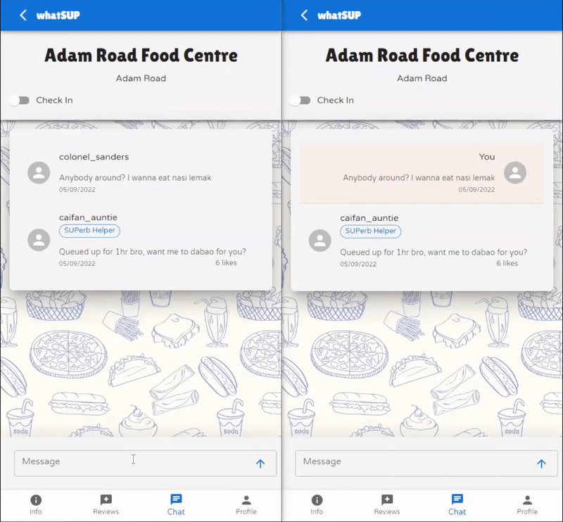
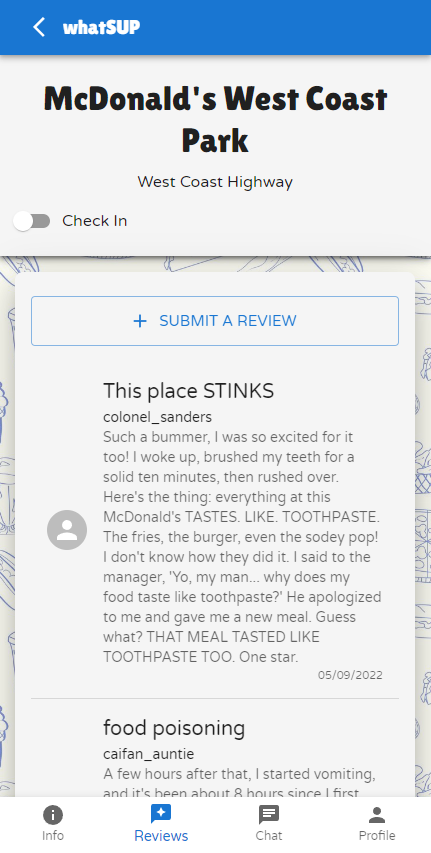

# WHATSUP - An app for live restaurant updates

WhatSup is a full-stack app mobile webapp for users to share live updates on restaurants through live chatrooms and reviews.

## Deployed App

Coming soon

## Features

### Homepage / Restaurant Autocomplete

> Allows the user to search through any restaurant in Singapore using the Google Place Autocomplete & Details APIs
>
> 

### Live Chatroom

> Individual restaurants have their own chatrooms so that users can find out how things are at the restaurant by users who are currently there.
>
> 

### Telegram Notifications

> When a user is checked into a restaurant, the telegram bot (activated by the user on signup prompt) will provide notifications whenever a new user is posting messages in the restaurant's chatroom.
>
> 

### Reviews

> Users who are logged-in can leave reviews on a restaurant of their choice, and these reviews can be viewed by all other users.
>
> 

### User Rewards

> Users can get badges through completing objectives related to using the app.
> These badges appear next to their usernames in chatrooms.
>
> 

## Local Setup

To get a local copy running, just follow these steps:

### Prerequisites

- NPM
  ```sh
  npm install npm@latest -g
  ```
- PostgreSQL
- Telegram bot key - Please contact me if you would like to set this app up locally, so I can share mine with you in a .env file (otherwise you can create your own Telegram bot key)

### To run

1. Clone the repo
2. Install NPM packages
   ```sh
   npm i
   ```
3. Initiate the database with Sequelize
   ```sh
   npx sequelize db:create && npx sequelize db:migrate && npx sequelize db:seed:all
   ```
4. Run app
   ```sh
   npm run start
   ```

## Built With

|                   | Tech Stack                                                                                                                              | Purpose           |
| ----------------- | --------------------------------------------------------------------------------------------------------------------------------------- | ----------------- |
| **Frontend**      | [React](https://github.com/facebook/react/)                                                                                             | User interface    |
|                   | [Material UI](https://github.com/mui/material-ui)                                                                                       | Component library |
| **Backend**       | [Node.js](https://github.com/nodejs/node)                                                                                               | Server            |
|                   | [Express](https://github.com/expressjs/express)                                                                                         | Server            |
|                   | [PostgreSQL](https://www.postgresql.org/)                                                                                               | Database          |
|                   | [Sequelize](https://sequelize.org/)                                                                                                     | Database          |
| **Functionality** | [Google Places Autocomplete Service](https://developers.google.com/maps/documentation/javascript/reference/places-autocomplete-service) | Autocomplete      |
|                   | [Google Place Details](https://developers.google.com/maps/documentation/places/web-service/details)                                     | Authentication    |
|                   | [Telegram](https://core.telegram.org/bots/api)                                                                                          | Notifications     |

## Created by:

**Gerald Khor** | [GitHub](https://github.com/gcskhor/) • [LinkedIn](https://www.linkedin.com/in/gerald-khor/) • [Email](mailto:gcskhor94@gmail.com)
